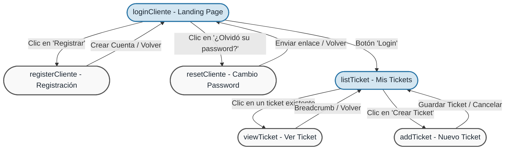

```mermaid

graph TD
    %% Definición de nodos (Pantallas)
    A([loginCliente - Landing Page])
    B([registerCliente - Registración])
    C([resetCliente - Cambio Password])
    D([listTicket - Mis Tickets])
    E([viewTicket - Ver Ticket])
    F([addTicket - Nuevo Ticket])

    %% Navegación desde Login
    A -->|Clic en 'Registrar'| B
    A -->|Clic en '¿Olvidó su password?'| C
    A -->|Botón 'Login'| D

    %% Navegación de retorno al inicio
    B -->|Crear Cuenta / Volver| A
    C -->|Enviar enlace / Volver| A

    %% Navegación principal del usuario logueado
    D -->|Clic en un ticket existente| E
    D -->|Clic en 'Crear Ticket'| F

    %% Retornos a la lista
    E -->|Breadcrumb / Volver| D
    F -->|Guardar Ticket / Cancelar| D
    
    %% Estilos: pantallas principales en azul y secundarias en gris claro
    classDef main fill:#d4e6f1,stroke:#2874a6,stroke-width:2px,color:#1b2631;
    classDef secondary fill:#f9f9f9,stroke:#555,stroke-width:2px,color:#1b2631;
    class A,D main;
    class B,C,E,F secondary;
``` 